# Sonderful
Sonderful is a cross-platform mobile application that helps adults combat social isolation by making it easy to discover and join spontaneous, casual plans with people nearby - a walk, a pint, a coffee, a kickabout. Built with .NET MAUI and ASP.NET Web API, it runs on both Windows and Android.

## Screenshots

### Windows

<p align="center">
  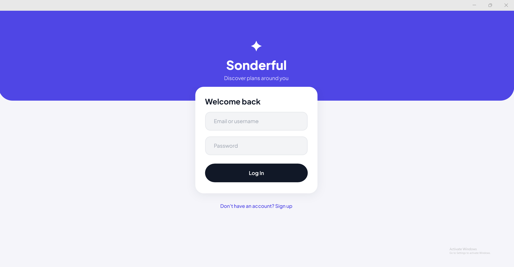
  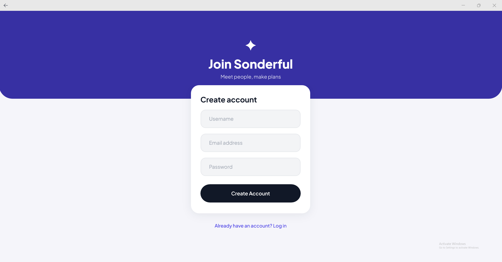
  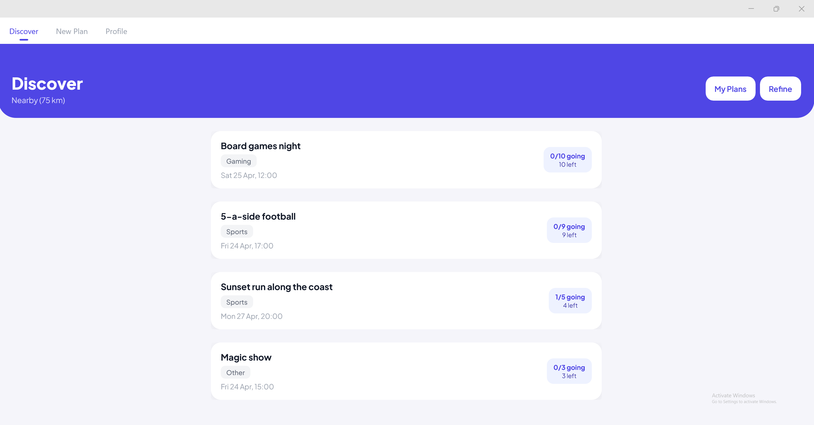
</p>
<p align="center">
  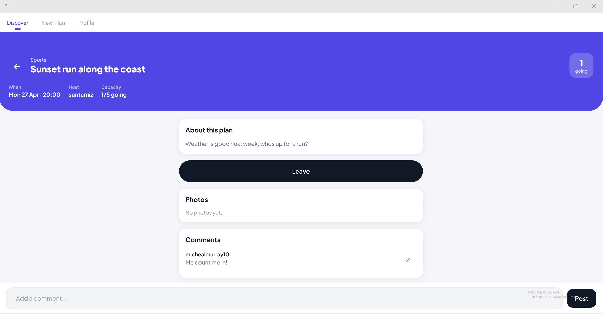
  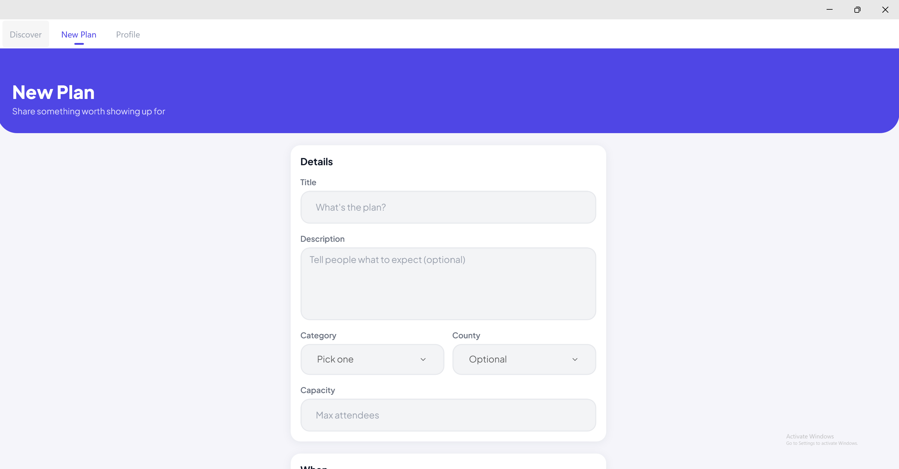
  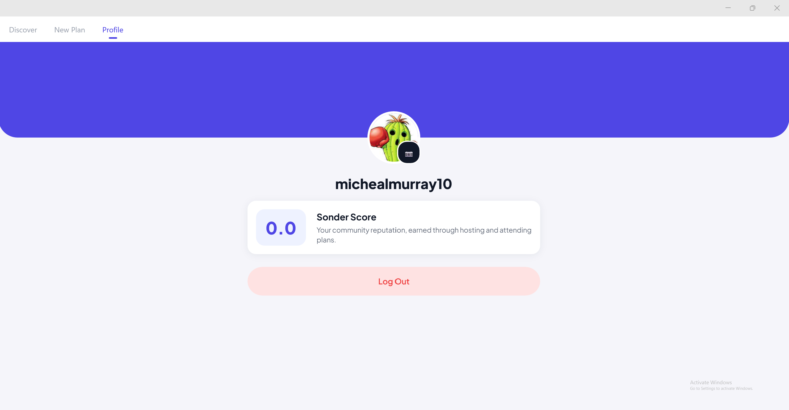
</p>

### Android

<p align="center">
  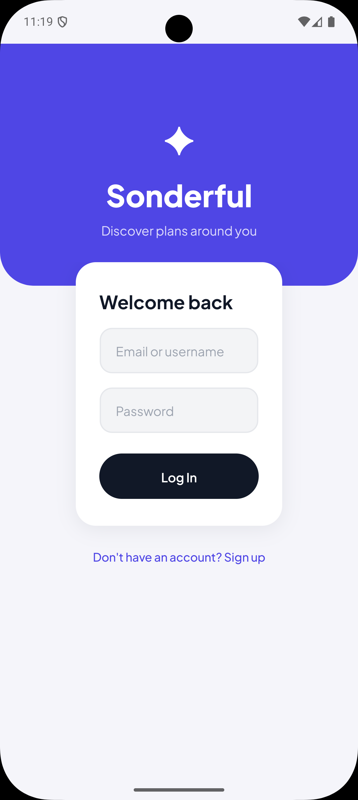
  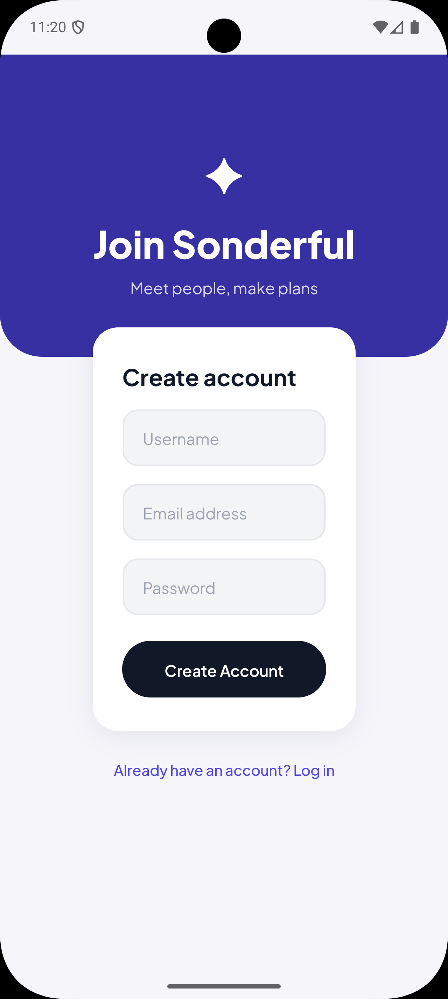
  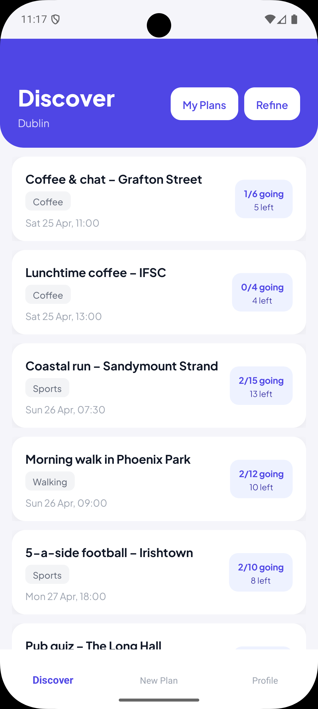
</p>
<p align="center">
  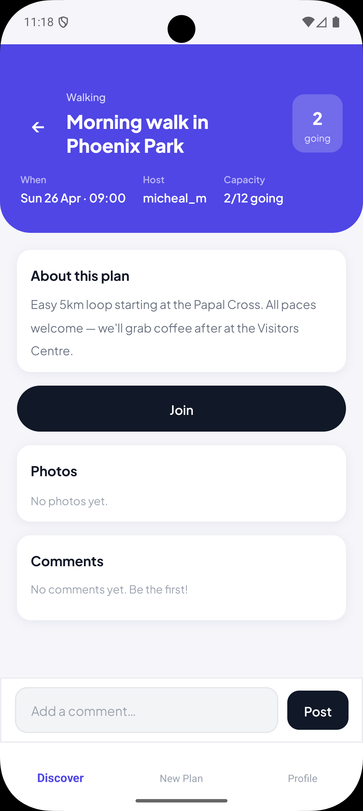
  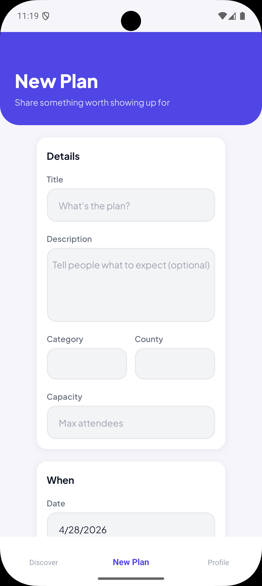
  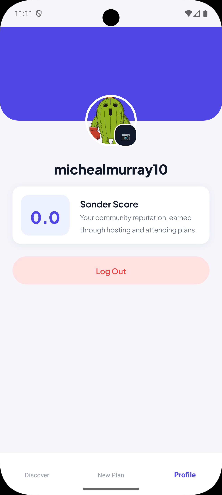
</p>

## Tech Stack

- **Frontend** - .NET MAUI 10
- **Backend** - ASP.NET Core 10 Web API
- **Database** - SQLite via Entity Framework Core
- **Auth** - JWT Bearer tokens
- **Tests** - xUnit, Moq, EF Core InMemory, WebApplicationFactory

## Features

- Register and log in with email or username
- Discover plans nearby using GPS or filter by county, category and date
- Create, edit and delete plans
- RSVP to plans, leave comments and upload photos
- Rate other attendees on reliability after an event (Sonder Score)

## Running Locally

**Prerequisites:** Visual Studio 2022+ with the .NET MAUI workload, .NET 10 SDK

1. Clone the repo and open `Sonderful.slnx` in Visual Studio
2. Set `Sonderful.API` as the startup project and run it - the API starts on `http://localhost:5082`
3. Switch the startup project to `Sonderful.App` and run targeting Windows or an Android emulator

The API URL is configured automatically - `localhost:5082` for Windows and `10.0.2.2:5082` for Android emulator.

## Project Structure

```
Sonderful.API/     - REST API (controllers, services, repositories, EF Core)
Sonderful.App/     - MAUI frontend (views, view models, DTOs, services)
Sonderful.Tests/   - Unit and integration tests
```

## Tests

Open Test Explorer in Visual Studio and run all tests. 80 tests covering auth, plans, comments, scoring and integration.
